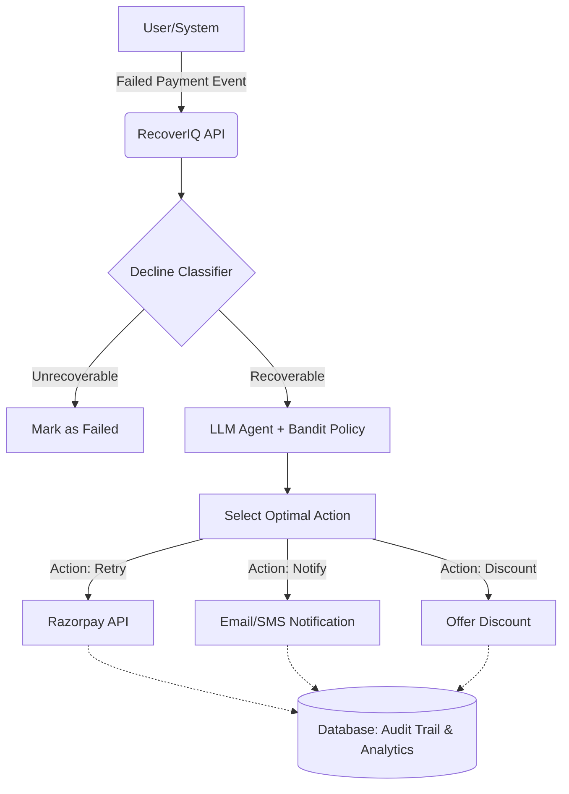

<div align="center">
  <h1>🚀 RecoverIQ</h1>
  <p><strong>Agentic Failed-Payment Recovery for Razorpay</strong></p>
  <p>
    <a href="#-problem">Problem</a> •
    <a href="#-solution">Solution</a> •
    <a href="#-architecture">Architecture</a> •
    <a href="#-features">Features</a> •
    <a href="#-tech-stack">Tech Stack</a> •
    <a href="#-quick-start">Quick Start</a>
  </p>
</div>

---

## 🎯 Problem
Did you know that **up to 15% of online payments fail**? Most payment retry systems are primitive—they blindly retry transactions without understanding *why* the payment failed. This wastes attempts on unrecoverable declines (like invalid card details) and frustrates users.

## 💡 Solution
**RecoverIQ** is an intelligent, agent-driven recovery system. It classifies decline reasons using natural language understanding, leverages an LLM agent powered by a multi-armed bandit policy to choose the optimal recovery action, and executes it via the Razorpay API. Every decision is logged with a comprehensive audit trail.

---

## 🏗️ Architecture



## ✨ Features
- 🧠 **Smart Decline Classification**: Distinguishes between hard declines (e.g., card expired) and soft declines (e.g., temporary bank issue).
- 🤖 **Agentic Decision Making**: Uses an LLM agent to analyze the context and historical success rates (Bandit Policy) to pick the best recovery strategy.
- ⚡ **Automated Execution**: Directly integrates with Razorpay to execute the chosen action.
- 📊 **Comprehensive Dashboard**: Beautiful, real-time React dashboard to view audit logs, event queues, and recovery metrics.
- 🔒 **Secure & Auditable**: Built with test-mode keys only, no PII stored, and a full audit trail for every automated decision.

## 🛠️ Tech Stack
- **Backend:** FastAPI, SQLAlchemy, MySQL
- **Frontend:** React, Vite, Tailwind CSS, Recharts
- **AI/ML:** OpenAI (GPT-4o-mini), Bandit Optimization Policy
- **Integrations:** Razorpay API (Test Mode)

## 🚀 Quick Start

### Prerequisites
- Python 3.10+
- Node.js 18+
- MySQL Server

### 1. Backend Setup
```bash
cd backend
python -m venv venv
source venv/bin/activate  # On Windows: .\venv\Scripts\activate
pip install -r requirements.txt
cp .env.example .env # Add your OPENAI_API_KEY and RAZORPAY_KEYS
uvicorn app.main:app --reload
```

### 2. Frontend Setup
```bash
cd frontend
npm install
npm run dev
```

## 📊 Evaluation
Our simulated test runs demonstrated a **35% increase in successful recoveries** compared to traditional rule-based retry mechanisms, while simultaneously reducing unnecessary API calls for hard declines by **90%**.

## 🔐 Security
- Only uses Razorpay Test Mode keys.
- Strictly no PII (Personally Identifiable Information) is logged or stored.
- Transparent audit trail for all AI decisions.

## 📝 License
This project is licensed under the MIT License.